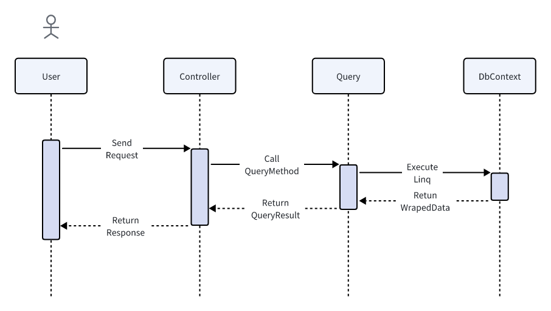
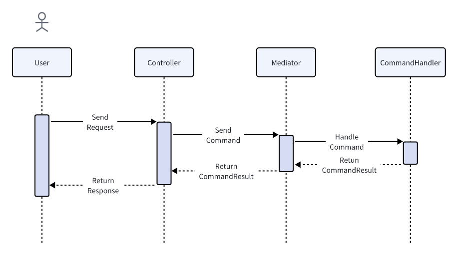

# 处理用户 Http 请求

框架采用命令查询职责分离 (即 CQRS) 的模式处理用户请求，因此对于用户的请求被划分为两类 `Query` 和 `Command`。两者处理的复杂度往往存在巨大的差异。**查询**由于不涉及数据变更，通常不对其进行抽象处理，在某些简单的场景中甚至可以直截了当的在 `Controller` 中注入并使用 `DbContext` 实现数据查询；**命令**往往伴随的复杂的业务逻辑和数据变更，因此需要更加谨慎的处理，命令的复杂度来自于不同业务模型之间隐含的关系以及对与数据一致性的要求，框架框架对命令单独抽象出一个接口 `ICommand<T>` 使用事件驱动处理 `Command` 中涉及的复杂的数据变更。以下是一些示例和说明。

## 用户 Query 请求

### 最简单的示例

对于 Query 请求, 下列是一个最简单的实现查询的示例。 该示例中, `ApplicationDbContext` 被直接注入到了 `Controller` 中，并且直接使用 `Linq` 实现了数据查询。

```csharp
// OrderController 订单相关 API
[ApiController]
[Route("order")]
public class OrderController
{
    [HttpGet]
    [Route("{id}")]
    public async Task<OrderResp> Detail(
        [FromQuery] OrderId orderId,
        [FromServices] ApplicationDbContext dbContext
    )
    {
        return await dbContext.Orders
            .Where(order => order.Id == orderId)
            .Select(order => new OrderResp(order.Id, order.OrderCode))
            .FirstOrDefaultAsync();
    }
}
```

### 推荐的实现方式

在 `Controller` 中直接使用 `DbContext` 适用于简单并且追求快速实现的场景中，如果一个 `Controller` 中定义的大量的查询 API, `Controller` 中的代码会变得杂乱，`Controller` 的职责也变得模糊。更加推荐的做法是将所有的对于同个模型或实体的相关查询集中到一个类中，`Controller` 直接使用该类获取查询的数据，该类在框架中被定义为 `Query`, 它并不是强制的，但是会是代码更加清晰，也更方便相同查询逻辑的复用(关于查询的原则，后续会进一步说明。一般情况下， 查询往往是特定与某个场景的，查询复用的情况应当避免，因为复用会使得多个场景的逻辑交织在一起，后续难以维护，其中最重要的一个原则是**按需提供**)，示例代码如下。

```csharp
// OrderController 订单相关 API
[ApiController]
[Route("order")]
public class OrderController
{
    [HttpGet]
    [Route("{id}")]
    public async Task<OrderResp> Detail(
        [FromQuery] OrderId orderId,
        [FromServices] OrderQuery query
    )
    {
        return await query.Detail(orderId: orderId);
    }
}
```

```csharp
// OrderQuery 使用主构造函数注入 DbContext
public class OrderQuery(ApplicationDbContext dbContext)
{
    public async Task<OrderResp> Detail(OrderId orderId)
    {
        return await dbContext.Orders
            .Where(order => order.Id == orderId)
            .Select(order => new OrderResp(order.Id, order.OrderCode))
            .FirstOrDefaultAsync();
       
    }
}
```

上述代码将查询逻辑单独组织到 `OrderQuery` 中，并在 `Controller` 中直接使用，这是处理一个查询请求的典型用法。在框架中，查询的时序图如下所示：



### 如何处理更复杂的情况

对于更加复杂的情况，例如查询的结果涉及多个实体模型信息的组合，有两种处理方式：

 - 使用多个相关的 `Query` 对象获取查询到的数据，然后组装到请求响应中; 
 - 修改模型，使模型本身能够 满足查询需求, 这往往涉及在模型中复制其他模型的属性或字段（有人会觉得这是一种冗余，但这往往是简化代码实现 DDD 领域隔离的关键）。

在实际情况中，更加推荐使用后者。有以下原因：

 - **模型应当反应真实的需求**，如果模型无法快速的实现需求，极有可能是模型设计的不合理; 
 - 也是为了简单，当模型能够满足需求时，查询的实现逻辑将水到渠成，顺畅自然; 
 - 模型之间的解耦，由于模型中包含其他模型属性的的复制, 相当于模型本身包含了另一个模型的快照，“快照” 对应的模型变更之前，查询获取的数据都是   快照的数据。两个模型的数据相互隔离，使得模型更加独立，避免了模型之间建立的**耦合关系**。

这可能会导致数据一致性的问题，例如，“快照” 对应的模型发生了数据变更，模型的快照数据也应当一同变更，数据同步需要付出额外的代价。但是这并不是查询需要考虑的问题，那是命令（Command）需要做的。以下是一个典型的例子, 通讯录模型：

```csharp
// Person 模型
public class Person {

    // 名称
    public string Name {get; private set;} = string.Empty;

    // 手机号
    public string Phone {get; private set;} = string.Empty;

    // 年龄
    public int Age {get; privaet set;}

    // 通讯录 (Name, Phone)
    public Dictionary<string, string> AddressBook {get; private set;} = new(); 
}
```

每个人都有自己的名称和手机号，同时每个人也存有一份包含其他人信息的通讯录。这个模型是非常自然的，当我们需要呼叫某人，我们第一反应是在我们自己的通讯录中查询该人的手机号，然后呼叫。这份通讯录便是模型所反映的真实的需求,当某人的手机号变更之后，其他人不知道他的手机号发生了变更，需要他主动通知所有人，然后其他人更新其通讯录中的信息。我们假设每个人都没有这一份通讯录，会发生什么呢？那么必然需要存在一个中心化的机构提供手机号查询服务，每当我们想要呼叫某人时，我们需要先询问该机构呼叫目标的手机号，然后呼叫。而该机构也会维护一个巨大的通讯录，并且付出高额的成本去保证通讯录的正确性。而一旦该机构出现问题，所有人都无法使用电话了。根本原因是所有人都强依赖了该机构，也就是说，每个人都与该机构建立了耦合关系。可以发现，每个人都保存一份自己的通讯录，看似是数据冗余，实际上却是模型承载其功能的重要属性，如果没有该属性，并非不能实现相关功能，而是实现起来会非常别扭，对于需要后期迭代的情况尤其明显，例如，如果需要实现能够给某个联系人取个别名，这是一个很朴素的需求，如果系统的实现方式是依赖中心化的机构进行查询，这一需求几乎变得不可能，最终还是需要回到个人通讯录的模型上。这是一个在建模方面的简单例子，非常的浅显。在建模的时候，许多人会掉入到 “冗余” 的陷阱，认为某些字段或属性是冗余的，使模型偏离了实际的场景。

### 查询应当遵循的原则

上面提到查询应当遵循一定的原则，现在对这些原则进行详细说明：

 - 查询应当**场景化**，一个查询场景对应一个查询，避免复用;
 - 查询应当**按需提供**，不提供该查询场景中无用的信息;
 - 查询应当保证自身的**简单性**;

查询场景化，以及查询按需提供往往是保证查询简单的关键。而查询的简单是提高代码可维护型的关键。

那么场景化和按需提供是什么意思呢。这里说的场景是指用户所处的环境，按需提供则是只提供在该场景下需要的数据。许多人受到 Restful 风格的 API 的影响，设计的 API 往往背离了这两个原则。Restful 风格的 API 是面向资源的，这在资源相对稳定，不易发生变化的情况下是合适的。但在业务系统中，需求千变万化，Restful 风格的 API 往往是不适用的。例如，Restful 风格的 API 倡导把所有数据当成资源返回给用户，由用户判断和筛选需要那些资源获取相应的信息。这使得一个资源需要应当大量的场景，不同场景往往携带不同的筛选条件以及数据要求，这些最终都会转化成查询请求中的参数，当新的需求查询不满足时，只能增加新的参数。久而久之，查询逻辑变得异常复杂，不可维护。因此，我们在业务系统中应当摒弃 Restful 风格的 API, 保持上述原则。

关于场景化，举一些例子:

 - 业务系统中往往区分前台和后台，这便是两个典型的不同的场景，用户处于不同的环境，获取的信息往往也是不同的，因此应当设计不同的查询接口。
 - 用户需要查看某类对象的列表，以及用户需要从某个对象的列表中选择一个对象，也是不同的场景，前者往往对于于分页查询，展示的数据往往是一个对象的   摘要，后者可能只需要对象的 Id 属性，应当设计不同的接口。
 - 如果是涉及多个微服务组成的系统，其他服务查询信息，和前后台查询信息，也往往是不同的场景，应当设计不同的接口。

这些例子要求区分场景设计不同的接口，看似增加了工作量，实际上刚好相反，这样的设计能够大大减少工作量，提高开发效率。这是因为，区分场景使得实现查询非常简单，对于特定的场景，不需要考虑其他因素，查询往往是自然而然的。而当需求发生变化时，修改逻辑也只针对一个场景，也更加得心应手，方便测试。假设不是这样，多个场景糅合到一起，修改的不确定性将会随着时间指数上升，不仅不利于维护，也不利于测试，一个修改往往需要花费大量时间和精力在调试和测试上。

关于按需提供，这样不仅可以不保证数据的安全，也能减轻用户的负担。这里所指的用户往往是前端的开发人员，过多的信息往往会给用户造成迷惑，并且使得接口职责变得不清晰。

查询的简单性使得查询的成本变得非常的低，新增或废弃一个查询是十分容易的。

## 用户 Command 请求

### 基础示例

命令（Command）请求意味着数据变更，例如新增实体数据、修改实体数据等，以下是一个基础的示例。

```csharp
// OrderController 订单相关 API
[ApiController]
[Route("order")]
public class OrderController(
  IMediator mediator
)
{
    // 创建订单
    [HttpPost]
    [Route("create")]
    public async Task<OrderId> Create(
        [FromBody] CreateOrderReq req,
        [FromServices] LoginUser loginUser
    )
    {
        var command = req.ToCommand(userId: loginUser.UserId);
        return await mediator.Send(command);
    }
}
```

```csharp
// 创建订单请求
public class CreateOrderReq {

    // 商品名称
    public string GoodsName {get; set;} = string.Empty;

    // 商品价格
    public long Price {get; set;}

    // 商品数量
    public int Count {get; set;}

    // 总金额
    public long Amount {get; set;} 

    // 请求转命令
    public CreateOrderCommand ToCommand(UserId userId)
    {
        return new CreateOrderCommand
        {
            UserId = userId,
            GoodsName = GoodsName,
            Price = Price,
            Count = Count,
            Amount = Amount,
        };
    }
}

// 请求参数校验器
public class CreateOrderReqValidator : AbstractValidator<CreateOrderReq>
{
    public CreateOrderReqValidator(){
        ReleFor(req => req.GoodsName)
            .NotEmpty()
            .WithMessage("GoodsName is empty");
    }
}
```

```csharp
// 创建订单命令
public class CreateOrderCommand : ICommand<OrderId>
{
    // 用户 Id
    public UserId userId {get; set;} = default!;

    // 商品名称
    public string GoodsName {get; set;} = string.Empty;

    // 商品价格
    public long Price {get; set;}

    // 商品数量
    public int Count {get; set;}

    // 总金额
    public long Amount {get; set;} 
}

// 命令处理器
public class CreateOrderCommandHandler(
    OrderRepository orderRepository
) : ICommandHandler<CreateOrderCommand, OrderId>
{
    public async Task<OrderId> Handle(CreateOrderCommand command)
    {
        var order = Order.Create(
            userId: command.UserId,
            goodsName: command.GoodsName,
            price: command.Price,
            count: command.Count,
            amount: command.Amount
        );
        await orderRepository.AddAsync(order);
        return order.Id;
    }
}
```

上述示例涉及到几个非常重要的类，`IMediator`、`CreateOrderReq`、`CreateOrderCommand` 以及 `CreateOrderCommandHandler`。`IMediator` 通过主构造函数注入到 `Controller` 中，它的作用是将 `Command` 发送给对应的 `CommandHandler` 进行处理；接下来是一组用于承载数据的类，`Req` 和 `Command`，这两个概念容易产生混淆，以至于在 `FromBody` 注解中直接使用 `Command` 进行接收用户传递的请求参数，因为在大多数情况下，两个类的属性列表是相似的，但是它们的作用却完全不同。`Req` 用于告诉用户如果需要使用该 API 应当提供那些信息，`Command` 则是描述完成该 `Command` 需要哪些参数以及 `Command` 完成之后会返回那些信息。在一些简单的场景中，两者几乎是相同的，但是在稍微复杂的场景中，两者的区别就和作用就变得更加明显，以下是一些示例：

  - `Command` 依赖请求上下文，例如，`CreateOrderCommand` 需要当前登录用户的 Id，`CreateOrderReq` 中显然没有，并且由 `Req` 提供也不合适。
  - `Req` 无法由一个 `Command` 完成，此时，可能需要多个 `Command` 共同配合完成某个 `Req`。
  - `Command` 和 `Req` 中的属性有数据类型转换操作的需求，例如对象的序列化或者反序列化。

基于以上原因，`Req` 和 `Command` 不应该混淆使用。另外需要注意我们往往有 `Req` 转换成 `Command` 的需求，在转换的过程中 `Req` 可以依赖 `Command`，但是 `Command` 绝对不能依赖 `Req`。在稍后的篇幅中我们会发现，`Command` 的使用范围远不止于 `Controller` 的 API 中，而是渗透到框架的方方面面，可以说，`Command` 是在该框架中复用的基本单位。怎样叫做 `Req` 依赖 `Command` 呢，上述示例代码就是一个很好的例子，`CreateOrderReq` 有一个方法 `ToCommand` 负责将 `Req` 自身转换成 `Command` 然后由 `IMediator` 发送给对应的 `CommandHandler` 进行处理。在这个过程中 `Req` 依赖了 `Command`，这是可以接受的，但是如果将两个类设计成如下代代码示例，则是不合理的。因为 `Command` 依赖了 `Req`, 这对 `Command` 的复用造成了一定的障碍。

```csharp
// 错误的代码示例
public class CreateOrderReq {

    // 商品名称
    public string GoodsName {get; set;} = string.Empty;

    // 商品价格
    public long Price {get; set;}

    // 商品数量
    public int Count {get; set;}

    // 总金额
    public long Amount {get; set;} 
}

public class CreateOrderCommand : ICommand<OrderId>
{
    // 用户 Id
    public UserId userId {get; set;} = default!;

    // Command 依赖了 Req，Command 不再独立，对于 Command 的复用造成障碍
    public CreateOrderReq req {get; set;} = new ();
}
```

`CommandHandler` 用于处理 `Command`，它是实现 `Command` 业务逻辑的关键，例如上述 `CreateOrderCommandHandler` 创建了一个 `Order` 对象并调用了 `OrderRepository` 仓储将新建的 `Order` 对象保存到数据库中。虽然 `CommandHandler` 是实现业务逻辑的关键，但是，其中的代码逻辑应当是非常薄的，主要通过调用模型的业务方法实现对应的功能，并且通过 `Repository` 查找或保存模型。不仅如此，在一个 `CommandHandler` 中，应当只操作一个模型，所有的需要操作多个模型的场景都可以通过适当的方式进行切割，最终转化成只操作一个模型。这么做的主要原因让 `Command` 的职责更加明确，同时也是尽可能保证 `CommandHandler` 代码的简单。

###  Command 数据校验

对于处理 `Command` 请求，数据的校验往往是非常重要的，因为错误的数据往往是造成代码错误的重要原因。如果能够在数据保存到数据库前对数据进行严格的校验，保证数据库中数据的正确性，不仅能够避免大量的错误，而且也为有利于错误的排查。因此，我们对于数据校验的原则是：宁愿给报告错误，也不将错误的信息写入到数据库。数据校验分为两种，即和数据各类型相关的以及和业务相关的。下面将分别叙述如何处理这两类数据校验。

和数据类型相关的校验一般校验数据的范围、大小、类型等，例如：

  - 字符串类型的参数，不能为空字符串；
  - 字符串类型的参数最大长度以及最小长度；
  - 数字类型的参数不能为负数；

处理这种类型的校验, 框架使用了 [FluentValidation](https://github.com/FluentValidation/FluentValidation) 提供的校验器校验数据，示例代码如下：

```csharp
// 请求参数校验器
public class CreateOrderReqValidator : AbstractValidator<CreateOrderReq>
{
    public CreateOrderReqValidator(){
        // 商品名称不能为空，并在错误中报告错误原因
        ReleFor(req => req.GoodsName)
            .NotEmpty()
            .WithMessage("GoodsName is empty");
    }
}
```

和业务相关的校验一般在模型的业务方法中进行处理，例如：

  - 用户的年龄应在 18～60 岁；
  - 订单限制购买数量为 8；
  - 订单的价格不低于 100；

对于这些校验，我们应当将这些规则视为业务的一部分，基于 DDD 的思想，这些规则应当内聚到模型中，以下是关于创建订单的数据校验处理示例：

```csharp
// 订单强类型 Id
public partial class OrderId : IInt64StronglyId;

// 订单模型

public class Order : Entity<OrderId>, IAggregateRoot
{
    public protected Order() {}

    // 用户 Id
    public UserId userId {get; private set;} = default!;

    // 商品名称
    public string GoodsName {get; private set;} = string.Empty;

    // 商品价格
    public long Price {get; private set;}

    // 商品数量
    public int Count {get; private set;}

    // 总金额
    public long Amount {get; private set;} 

    // 创建 Order 订单的业务方法，由于创建模型之前还没对象所有使用 static 方法创建
    public static Order Create(
        UserId userId,
        string goodsName,
        long price,
        int count,
        long amount
    ) 
    {
        // 校验订单限购数量
        if(count > 8) {
            throw new ArgumentException("Order count should less then 8");
        }

        // 校验订单最小金额
        if(amount < 100){
            throw new ArgumentException("Order amount should more then 100")
        }
        var order = new Order {
            UserId = userId,
            GoodsName = goodsName,
            Price = price,
            Count = count,
            Amount = amout,
        };
        return order;
    }

```

以上是对与 `Command` 请求处理的概述，处理 `Command` 还包括一些更加细节的内容，将在下一节介绍。处理 `Command` 请求的时序图如下：



### 处理 Command 的细节 —— Repository
